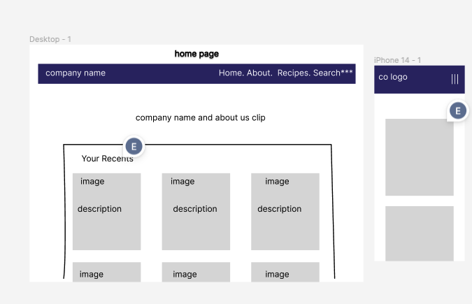
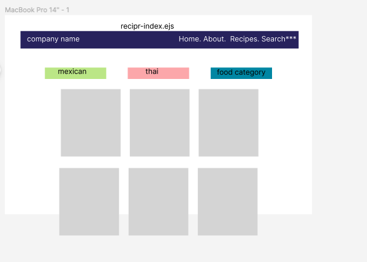
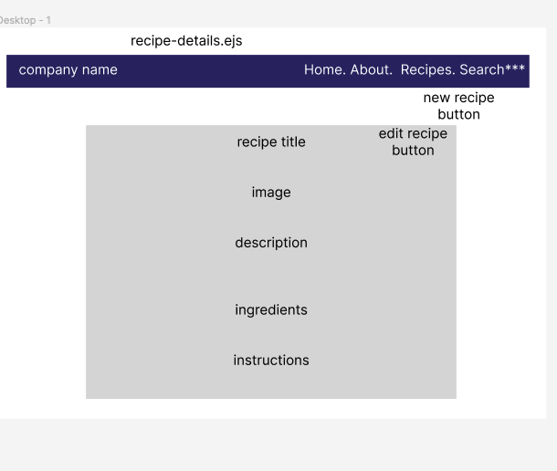
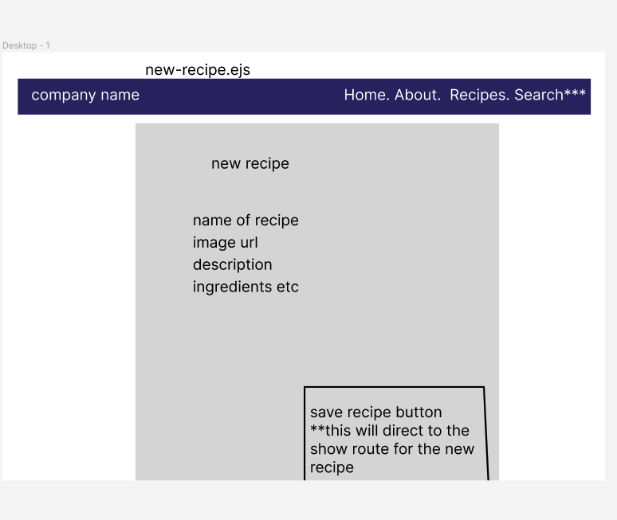

# Recipe-App

MEN-Stack Recipe App

## Link to Site...

Still to come via Heroku...

## List of the Technologies Used:

- Node.js
- Postman
- Visual Studio Code
- Express
- Heroku
- EJS
- MongoDB
- Mongoose
- SCSS
- Bootstrap
- Git & Github
- Figma

## User Stories:

- As a user of (insert company name), I wish to organize all of my recipes and be able to easily reference them later.
- As a person who never knows what to eat, I hope to save recipes and be able to type in ingredients I have and get feedback as to what I could potentially make.

## Wire Frames

## Unsolved Problems &/OR Hurdles

I have yet to add an about page to my site, but for now, I figured it's not necessary for users.
